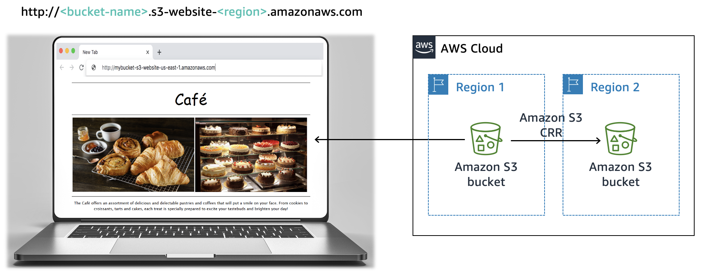

# ☁️ AWS S3 Static Website Hosting with Data Protection and Disaster Recovery


---

## 📌 Project Overview

A small café business needed a digital presence to expand customer awareness beyond walk-in traffic. This project delivers a **production-grade static website hosted entirely on Amazon S3**, transforming a zero-cloud-footprint business into one with a resilient, globally accessible web presence — all without a single web server.

Beyond just "getting the site live," this project tackles four real-world operational challenges that any cloud architect faces: **public hosting**, **data protection**, **cost optimization**, and **disaster recovery**. Each challenge maps directly to a pillar of the AWS Well-Architected Framework, making this not just a website deployment but a demonstration of enterprise-level cloud thinking applied to a small business context.

The result is a website that is publicly accessible, protected against accidental data loss, cost-optimized through intelligent storage tiering, and resilient to regional outages — all with zero server management overhead.

---

## ✨ Key Features

- **Serverless Static Hosting** — Entire website served from Amazon S3 without any EC2 instances or web servers, dramatically reducing operational overhead and cost.
- **Public Access via Bucket Policy** — Automated IAM bucket policy grants read-only access to anonymous public users, eliminating per-object manual permission management.
- **Object Versioning** — Full version history maintained on all website assets, enabling instant rollback from accidental overwrites or deletions.
- **S3 Lifecycle Policies** — Two-stage automated lifecycle management transitions older object versions to S3 Standard-IA after 30 days and permanently deletes them after 365 days, keeping storage costs under control as the site scales.
- **Cross-Region Replication (CRR)** — Automated replication of all bucket objects to a secondary AWS region, providing geographic redundancy and a live disaster recovery target.
- **IAM Role-Based Replication** — Least-privilege `CafeRole` IAM role scoped specifically for S3 replication actions (`s3:ReplicateObject`, `s3:ReplicateDelete`, `s3:ReplicateTags`), following AWS security best practices.

---

## 🛠️ Tech Stack

| Layer | Technology |
|---|---|
| Cloud Provider | Amazon Web Services (AWS) |
| Storage & Hosting | Amazon S3 (Simple Storage Service) |
| Access Control | AWS IAM (Identity and Access Management) |
| Replication | S3 Cross-Region Replication (CRR) |
| Storage Tiers | S3 Standard → S3 Standard-IA |
| Policy Language | JSON (Bucket Policies), YAML (IAM Role Policy) |
| Frontend | HTML5, CSS3 |
| Architecture Framework | AWS Well-Architected Framework |

---

## 🏗️ Architecture

The architecture follows a multi-region static hosting model with automated replication:

```
Browser
  │
  ▼
http://<bucket-name>.s3-website-<region>.amazonaws.com
  │
  ▼
┌─────────────────────────────────────────────────┐
│                   AWS Cloud                     │
│                                                 │
│  ┌──────────────────┐    CRR    ┌─────────────┐ │
│  │    Region 1      │ ───────►  │  Region 2   │ │
│  │  Amazon S3       │           │  Amazon S3  │ │
│  │  (Source Bucket) │           │  (DR Bucket)│ │
│  └──────────────────┘           └─────────────┘ │
└─────────────────────────────────────────────────┘
```

> See `architecture-diagram.png` for the full visual reference.



---

## 🚀 Deployment Steps

### Prerequisites
- An active AWS account with console access
- The website source files: `index.html`, `/css`, and `/images` folders
- AWS region selected: `us-east-1` (US East — N. Virginia) for the primary bucket

---

### Challenge 1 — Launch the Static Website

**Step 1: Create the S3 Source Bucket**
```
AWS Console → S3 → Create Bucket
  - Region: us-east-1
  - Uncheck: "Block all public access"
  - Enable: ACLs
```

**Step 2: Enable Static Website Hosting**
```
Bucket → Properties → Static website hosting → Enable
  - Index document: index.html
```

**Step 3: Upload Website Files**
```
Bucket → Upload
  - index.html
  - /css folder
  - /images folder
```

**Step 4: Create a Public Read Bucket Policy**

Navigate to `Bucket → Permissions → Bucket Policy` and apply:

```json
{
  "Version": "2012-10-17",
  "Statement": [
    {
      "Sid": "PublicReadGetObject",
      "Effect": "Allow",
      "Principal": "*",
      "Action": "s3:GetObject",
      "Resource": "arn:aws:s3:::<your-bucket-name>/*"
    }
  ]
}
```

Access your live website at:
```
http://<bucket-name>.s3-website-us-east-1.amazonaws.com
```

---

### Challenge 2 — Protect Website Data with Versioning

**Step 5: Enable S3 Versioning**
```
Bucket → Properties → Bucket Versioning → Enable
```

**Step 6: Upload a Modified Version**

Edit `index.html` — change the following color attributes:
```html
<!-- Change 1 -->
bgcolor="aquamarine"  →  bgcolor="gainsboro"

<!-- Change 2 -->
bgcolor="orange"      →  bgcolor="cornsilk"

<!-- Change 3 (second instance) -->
bgcolor="aquamarine"  →  bgcolor="gainsboro"
```

Re-upload to the bucket and verify via:
```
Bucket → Show Versions → Confirm two versions of index.html exist
```

---

### Challenge 3 — Optimize Storage Costs with Lifecycle Policies

**Step 7: Configure Two Lifecycle Rules**

Navigate to `Bucket → Management → Lifecycle Rules → Create Rule`

**Rule 1 — Transition to Standard-IA:**
```
Rule name: TransitionOldVersionsToIA
Scope: All objects in the bucket
Action: Move previous versions to Standard-IA
Days after object becomes previous version: 30
```

**Rule 2 — Expire Old Versions:**
```
Rule name: ExpireOldVersions
Scope: All objects in the bucket
Action: Permanently delete previous versions
Days after objects become previous versions: 365
```

---

### Challenge 4 — Enable Cross-Region Disaster Recovery

**Step 8: Create the Destination Bucket**
```
AWS Console → S3 → Create Bucket
  - Region: <any region OTHER than us-east-1>
  - Enable: Bucket Versioning (required for CRR)
```

**Step 9: Configure Cross-Region Replication on Source Bucket**
```
Source Bucket → Management → Replication Rules → Create Rule
  - Status: Enabled
  - Source: Entire bucket
  - Destination: <your destination bucket>
  - IAM Role: CafeRole
  - Replicate existing objects: No
```

**CafeRole IAM Policy (YAML reference):**
```yaml
Version: 2012-10-17
Statement:
  - Action:
    - s3:ListBucket
    - s3:ReplicateObject
    - s3:ReplicateDelete
    - s3:ReplicateTags
    - s3:Get*
    Resource:
      - '*'
    Effect: Allow
```

> **Production Note:** In a real environment, restrict the `Resource` field to only the ARNs of your source and destination buckets instead of `'*'`.

**Step 10: Verify Replication**

Upload a new version of `index.html` to the source bucket, then:
```
Destination Bucket → Confirm new object appears (may require page refresh)
Source Bucket → Verify 3 versions of index.html exist
```

---

## 📊 Key Takeaways

### Core Steps Completed

1. Created and configured an S3 bucket as a static website host with a public read bucket policy.
2. Uploaded HTML, CSS, and image assets and verified public accessibility via the S3 website endpoint URL.
3. Enabled object versioning to maintain a full history of all uploaded assets.
4. Configured two separate S3 lifecycle rules to automate storage cost reduction and data expiration.
5. Provisioned a secondary S3 bucket in a different AWS region and established a Cross-Region Replication rule between them.
6. Used an IAM role (`CafeRole`) to securely authorize the replication process between buckets.

### Architectural Best Practices Implemented

| Best Practice | AWS Well-Architected Pillar | Implementation |
|---|---|---|
| Protect data at rest | Security | S3 Object Versioning prevents accidental overwrites and deletions |
| Define data lifecycle management | Cost Optimization | S3 Lifecycle Policies tier and expire old object versions automatically |
| Automate disaster recovery | Reliability | S3 Cross-Region Replication provides a live, automated backup in a second region |
| Apply least-privilege access | Security | IAM `CafeRole` scoped to only required S3 replication actions |
| Serverless architecture | Operational Excellence | Static hosting on S3 eliminates server provisioning, patching, and management |

---

## 💡 What I Learnt

This project fundamentally shifted how I think about cloud storage — from treating S3 as a simple file store to recognising it as a feature-rich data management platform. Key takeaways include:

**S3 is more than object storage.** Features like static website hosting, bucket policies, versioning, lifecycle management, and cross-region replication make S3 a complete data management layer capable of meeting enterprise-level SLAs.

**Versioning is cheap insurance.** Once enabled, S3 versioning costs relatively little but provides invaluable protection. Recovering from an accidental overwrite or deletion becomes a matter of seconds rather than a crisis.

**Lifecycle policies turn cost control into a system.** Rather than manually managing storage tiers, lifecycle rules codify a data retention strategy — automatically moving cold data to cheaper tiers and purging what's no longer needed. This is the kind of automation that scales.

**Cross-region replication is a first step toward resilience, not the whole answer.** CRR replicates objects but does not automatically redirect traffic. A complete DR solution would pair CRR with DNS failover (e.g. Amazon Route 53) and monitoring to achieve automated recovery.

**IAM least-privilege matters even for internal service-to-service communication.** Even when both the source and destination are owned by the same AWS account, scoping IAM roles tightly reduces blast radius if a misconfiguration or security event occurs.

---

## 🔭 Future Improvements

1. **Add Amazon CloudFront CDN** — Place a CloudFront distribution in front of the S3 bucket to reduce global latency, enforce HTTPS, and enable custom domain support — moving away from the raw S3 website endpoint URL.

2. **Enable S3 Object Lock (WORM)** — For regulatory compliance or audit scenarios, implement Object Lock in Compliance mode to make objects immutable for a defined retention period, preventing even root-level deletion.

3. **Restrict the CafeRole IAM Policy to Specific Resources** — Replace the wildcard `Resource: '*'` in the replication IAM policy with the specific ARNs of the source and destination buckets, tightening the security posture for a production environment.

4. **Implement DNS Failover with Amazon Route 53** — Pair CRR with Route 53 health checks and latency-based routing so that traffic automatically shifts to the secondary region if the primary region becomes unavailable — completing the DR story.

5. **Add CI/CD Pipeline for Website Deployments** — Automate website updates using AWS CodePipeline or GitHub Actions to push changes to S3 on every commit, removing the manual upload step and enabling version-controlled deployments.

6. **Enable S3 Server Access Logging & CloudWatch Alerts** — Add access logging on the source bucket and configure CloudWatch alarms to detect unexpected spikes in requests, 4xx/5xx errors, or unusual data egress — providing observability for the hosted website.

7. **Migrate to HTTPS with a Custom Domain** — Register a domain via Route 53, provision a TLS certificate via AWS Certificate Manager (ACM), and serve the site over HTTPS through CloudFront for a fully branded, secure web experience.

---

## 📸 Visuals

| View | Description |
|---|---|
|  | Multi-region S3 architecture with CRR |

> **Live Demo:** *(Add your S3 website endpoint URL here once deployed)*
> ```
> http://<your-bucket-name>.s3-website-us-east-1.amazonaws.com
> ```

---

## 📚 References

- [Amazon S3 Static Website Hosting Documentation](https://docs.aws.amazon.com/AmazonS3/latest/userguide/WebsiteHosting.html)
- [S3 Bucket Policy Examples](https://docs.aws.amazon.com/AmazonS3/latest/userguide/example-bucket-policies.html)
- [S3 Lifecycle Configuration](https://docs.aws.amazon.com/AmazonS3/latest/user-guide/create-lifecycle.html)
- [Setting Up Cross-Region Replication](https://docs.aws.amazon.com/AmazonS3/latest/user-guide/enable-replication.html)
- [AWS Well-Architected Framework](https://docs.aws.amazon.com/wellarchitected/latest/framework/welcome.html)

---

